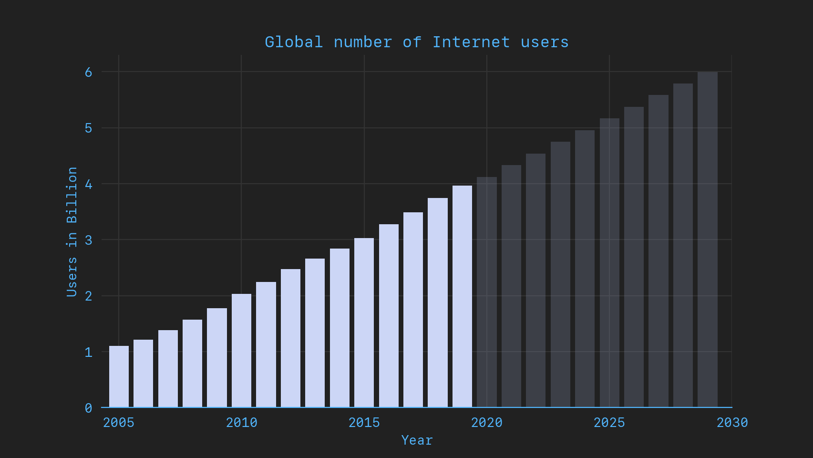

## Introduction

The Internet touches almost all aspects of the modern life in the developed world. We use services like Facebook and Instagram to stay connected, we use Uber and AirBnB in our holidays and Amazon to buy almost any product we can imagine.



Although these service have such a strong influence in our daily lifes and most importantly in our human interactions they have not the same legitimization as similarly influencial instituations based on democratic principles.

This imbalance of power between corporations that can control the way how a large portions of our society live, think and interact and the say that this portion has in the decision making process about how these platforms work hides a huge risk.

There are countless examples were the legistlator restricts these influential firms but it also feels like they're always a step behind.

In this blog post I want explain the ["what" and "so what"](link to Jean Doumont) of Web3. After you have finished reading you should have an understanding of Web3 and why it is important.

- answer the what and so what? Link Mai Thi - or where she got this from? Jean Doumont coined that

Outlook of this document

- The role of HTTP and why its important.

- basic primitives data + programs

## A brief history of the Internet

### The beginnings

### (ARPAnet)

### Web 1.0

HTTP request

```http
POST /test HTTP/1.1
Host: foo.example
Content-Type: application/x-www-form-urlencoded
Content-Length: 27

field1=value1&field2=value2
```

### Web 2.0

- interactive experiences
- user generated content
- Example corporations
  - Facebook
  - Uber
  - AirBnB
  - Instagram
- Core layers of innovation Mobile, social, cloud

#### Web 2.1 - Social Networks

#### Web 2.2 - Mobile computing

#### Web 2.3 - Cloud computing

- Social Networks
  - content generation
- Mobile
  - moved to an always-connected state
- Cloud
  - commoditization production maintenance of internet pages/applications

## A step back

With that being said web3 is part of a much larger phase transitions that also contains the aformentioned developments. We are moving from a pre-computing civiliazation to a post-computing civilization and compared to other transitions this one is incredibly fast. Because of that the future is really hard to predict.

The past developments happened in roughly 80 years and the Internet as we know it in the last 30 years. It is incredibly hard to predict what will happen in the next 30 years - let alone another 80 years from now.

This necessitates a humbling feeling of responsibility of everyone involved in shaping the next generation of the web. The choices of properties we give new technologies can have drastic implications not only to ourselves but for many more people in the future. More importantly also people that don't have the privilige of being able to build these things because of unfair wealth distribution around the globe.

<!-- ## Web 3.0

- term not new (semantic web)

- Umbrella Term for

	1. The decentralized Web
	2. Blockchains
	3. Linked Data

- What properties do we get from web3?
	- verifiable links (verifiability)
	- omission of intermediaries

- basic primitives data + programs


## Opinion

web3 much bigger leap forward than web1 -> web2.

beginning of web1.0 often named in connection with the widespread use of HTTP. Web2.0 is just and extended use of HTTP that made the web1.0 possible. In web3.0 the notion is to move forward and away from HTTP to build protocols that suit the applications best. I'd rather make the distinction of these eras as Web1.0 Web1.1 and Web 2.0

that's unlikely to catch up as web3 is often used as a marketing term

## Critizism


---

References
- [[2020-12-20]]
- [[resource-3]]
	- web2.0 between 1999 - 2004 bei oreilly
		- Properties:
			- moved away from static web pages
			- interactive. experiences
			- user generated content
			- bsp. Uber AirBnB Facebook Instagram Friendster MySpace
			- three core layers of innovation: mobile, social cloud
		- Mobile
			- moved to an always-connected state
		- Social Networks
			- content generation
		- Cloud
			- commoditization production maintenance of internet pages/applications
    - web3.0
		- leap forward in
			- open
			- trustless
			- permissionless
		- three core layers
			- edge computing
			- decentralised data networks
			- artificial intelligence
		-
- https://medium.com/@essentia1/why-the-web-3-0-matters-and-you-should-know-about-it-a5851d63c949

- https://stratechery.com/2021/internet-3-0-and-the-beginning-of-tech-history/
	- Web
		- 1.0 - technology
		- 2.0 - economics
		- 3.0 - politics
	- Discussion: https://news.ycombinator.com/item?id=25745573
	-
Utilities

- https://www.principiae.be/book/pdfs/TM&Th-3.0-summary.pdf -->
